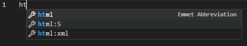

# Linked Building Data BIM app tutorial

This tutorial was developed for the 3rd Summer School of Linked Data in Architecture and Construction ([SSoLDAC](https://linkedbuildingdata.net/ldac2023/summerschool)). As part of the Interaction and querying lecture by [Mads Holten Rasmussen](https://www.linkedin.com/in/mads-holten-rasmussen-061b7414/), [NIRAS](https://www.niras.com/).

This repository contains all the code you will be developing. It is structured in separate branches for each step in the tutorial. The steps are quite limited in scope and the full tutorial will not take more than an hour to complete. So grab a hot cup of ☕ and let's get started.

## Overview
1. Start
1. [Dependencies](https://github.com/LBD-Hackers/LBD-app-tutorial/tree/01_Dependencies)
1. [Load IFC](https://github.com/LBD-Hackers/LBD-app-tutorial/tree/02_Load_IFC)
1. [Parse LBD](https://github.com/LBD-Hackers/LBD-app-tutorial/tree/03_Parse_LBD)
1. [In-memory triplestore](https://github.com/LBD-Hackers/LBD-app-tutorial/tree/04_In-memory_Triplestore)
1. [Dynamic UI](https://github.com/LBD-Hackers/LBD-app-tutorial/tree/05_Dynamic)
1. [Load/Save RDF](https://github.com/LBD-Hackers/LBD-app-tutorial/tree/06_Save)

## Before we begin
It is recommended that you do the coding in [VS Code](https://code.visualstudio.com/). We will be coding everythin in vanilla HTML/JavaScript, so no need to install a ⛰️ of tools and languages. Just get the [Live server](https://marketplace.visualstudio.com/items?itemName=ritwickdey.LiveServer) extension.

## 1. Start
In this first step of the tutorial we will open VS Code in an empty folder and add a single file called `index.html`. We will use some HTML 5 boilerplate code to get started. In VS Code you can start typing `ht` and then you should get the option to start from a HTML 5 template (see image below).



Let's edit the title (shown in the browser tab) and add a headline to the page:

```html
<!DOCTYPE html>
<html lang="en">
<head>
    <meta charset="UTF-8">
    <meta http-equiv="X-UA-Compatible" content="IE=edge">
    <meta name="viewport" content="width=device-width, initial-scale=1.0">
    <title>My LBD app</title>
</head>
<body>
    <h1>Hello LBD!</h1>
</body>
</html>
```

To view the result, right-click the file in the VS Code file explorer and select *"Open with Live Server"*. Now a browser window should open, and you should see the text **Hello LBD!**.

That's it for this step. Let's continue with the next step where we will be [adding some dependencies](https://github.com/LBD-Hackers/LBD-app-tutorial/tree/01_Dependencies).

[](https://www.buymeacoffee.com/madsholten)