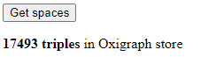
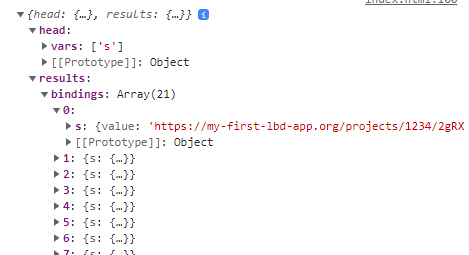

# Linked Building Data BIM app tutorial

This tutorial was developed for the 3rd Summer School of Linked Data in Architecture and Construction ([SSoLDAC](https://linkedbuildingdata.net/ldac2023/summerschool)). As part of the Interaction and querying lecture by [Mads Holten Rasmussen](https://www.linkedin.com/in/mads-holten-rasmussen-061b7414/), [NIRAS](https://www.niras.com/).

If you didn't do the first part, [start here](https://github.com/LBD-Hackers/LBD-app-tutorial/tree/00_Start).

## Overview
1. [Start](https://github.com/LBD-Hackers/LBD-app-tutorial/tree/00_Start)
1. [Dependencies](https://github.com/LBD-Hackers/LBD-app-tutorial/tree/01_Dependencies)
1. [Load IFC](https://github.com/LBD-Hackers/LBD-app-tutorial/tree/02_Load_IFC)
1. [Parse LBD](https://github.com/LBD-Hackers/LBD-app-tutorial/tree/03_Parse_LBD)
1. In-memory triplestore
1. [Dynamic UI](https://github.com/LBD-Hackers/LBD-app-tutorial/tree/05_Dynamic)

## 5. In-memory triplestore

In this step we will be loading the RDF triples generated in the [previous step](https://github.com/LBD-Hackers/LBD-app-tutorial/tree/03_Parse_LBD) into an Oxigraph in-memory triplestore that runs directly in the browser.

Since Oxigraph doesn't accept JSON-LD we will first need to convert it to NQuads. This can be achieved with the [toRDF() function in jsonld.js](https://www.npmjs.com/package/jsonld#user-content-tordf-n-quads).

```javascript
const jsonldTriples = await lbdParser.parse(ifcAPI, modelID);
const nquads = await jsonld.toRDF(doc, {format: 'application/n-quads'});
console.log(nquads);
```


Next, let's define a function that loads the triples into the store and executes another function that gives us the total count of triples in the store and prints the result in the user interface. First add an empty paragraph with id `store-size` after the Load IFC button in the HTML body:

```html
<p id="store-size"></p>
```

Then let's define the functions:

```javascript
async function loadInStore(nquads){
    await asyncOxigraph.load(nquads, "application/n-quads");
    getStoreSize();
}

async function getStoreSize(){

    // Execute query to get store size
    const query = `SELECT (COUNT(*) AS ?count) WHERE { ?s ?p ?o }`;
    const qRes = await asyncOxigraph.query(query);
    console.log(qRes);

    // Extract result from the JSON formatted query result
    const storeSize = qRes.data.results.bindings[0].count.value;

    // Update text in HTML paragraph
    document.getElementById("store-size").innerHTML = `<b>${storeSize} triples</b> in Oxigraph store`;
}
```

Execute the `loadInStore()` function right after converting to nquads and you should see the results.

```javascript
const jsonldTriples = await lbdParser.parse(ifcAPI, modelID);
const nquads = await jsonld.toRDF(doc, {format: 'application/n-quads'});
await loadInStore(nquads);
```

In the console you should now see a result coming from the async oxigraph web worker:


The query executed in only 37 ms for a store size of +17k triples which is quite acceptable for such a heavy query. Testing with the Schependomlaan IFC model yields ~286k triples and this query executes in ~0.3 s.

In the user interface you should see a text like this:


Now let's expand on this. Why not display a button once the triples are loaded into the store that executes a specific query like getting all the spaces? First, let's add this (initially hidden) button to the HTML body:

```html
<button id="get-spaces" style="display: none;">Get spaces</button>
```

Change the visibility after the triples are loaded into the store:
```javascript
document.getElementById("get-spaces").style.display = "block";
```

Add an event to the button like we did in the [Load IFC](https://github.com/LBD-Hackers/LBD-app-tutorial/tree/02_Load_IFC) step:

```javascript
document.getElementById("get-spaces").addEventListener("click", () => getSpaces());

async function getSpaces(){
    const query = `PREFIX bot: <https://w3id.org/bot#> 
    SELECT * 
    WHERE { ?s a bot:Space }`;
    const {data} = await asyncOxigraph.query(query);
    console.log(data);
}
```

Note that in this example I use `const {data} =` to only access the data part (the result of the query). This is a nice little shorthand trick that makes the code cleaner.

The user interface should now have the new button:



And clicking the button should lock the query result to the console:



In the [next step](https://github.com/LBD-Hackers/LBD-app-tutorial/tree/05_Dynamic) we add some simple user interactions that will trigger queries and UI updates.

[](https://www.buymeacoffee.com/madsholten)