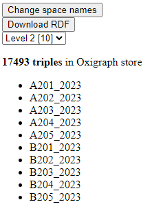

# Linked Building Data BIM app tutorial

This tutorial was developed for the 3rd Summer School of Linked Data in Architecture and Construction ([SSoLDAC](https://linkedbuildingdata.net/ldac2023/summerschool)). As part of the Interaction and querying lecture by [Mads Holten Rasmussen](https://www.linkedin.com/in/mads-holten-rasmussen-061b7414/), [NIRAS](https://www.niras.com/).

If you didn't do the first part, [start here](https://github.com/LBD-Hackers/LBD-app-tutorial/tree/00_Start).

## Overview
1. [Start](https://github.com/LBD-Hackers/LBD-app-tutorial/tree/00_Start)
1. [Dependencies](https://github.com/LBD-Hackers/LBD-app-tutorial/tree/01_Dependencies)
1. [Load IFC](https://github.com/LBD-Hackers/LBD-app-tutorial/tree/02_Load_IFC)
1. [Parse LBD](https://github.com/LBD-Hackers/LBD-app-tutorial/tree/03_Parse_LBD)
1. [In-memory triplestore](https://github.com/LBD-Hackers/LBD-app-tutorial/tree/04_In-memory_Triplestore)
1. Dynamic UI

## 7. Save

In this step it is demonstrated how you can download the content of the triplestore and give the user the option to either start from an IFC (requires parsing = slow) or simply directly from the RDF downloaded from another session. Oxigraph also supports update queries, so the in the app you could even allow the user to make changes that will all be included when saving RDF.

First add buttons for uploading and downloading RDF in the HTML body:

```html
<!-- Upload -->
<button id="load-rdf" onclick="document.getElementById('rdf-input').click()" style="display: none;">
    Load RDF
</button>
<input type="file" accept=".nq" id="rdf-input" style="display: none;">

<!-- Download -->
<button id="download" style="display: none;">Download RDF</button>
```

Make sure to set visibility to block when the buttons should appear in the UI (you know how by now).

We then assign event listeners and create assosiated functions:

```javascript
document.getElementById("rdf-input").addEventListener("change", ev => loadRDF(ev));
document.getElementById("download").addEventListener("click", ev => downloadStoreContent(ev));

async function loadRDF(ev){
    // Get file
    const file = ev.target.files[0];
    
    const reader = new FileReader();
    reader.readAsText(file, "UTF-8");
    reader.onload = async (evt) => {
        await loadInStore(evt.target.result);
        document.getElementById("load-ifc").style.display = "none";
        document.getElementById("load-rdf").style.display = "none";
    }
    reader.onerror = (err) => console.error(err);
}

async function downloadStoreContent(){
    const {data} = await asyncOxigraph.dump();
    download("data.nq", data);
}

function download(filename, text) {
    const element = document.createElement('a');
    element.setAttribute('href', 'data:application/n-quads;charset=utf-8,' + encodeURIComponent(text));
    element.setAttribute('download', filename);
    element.style.display = 'none';
    document.body.appendChild(element);
    element.click();
    document.body.removeChild(element);
}
```

Loading the file is just a matter of getting the string content of the file and then using the already existing `loadInStore()` function. Downloading the content uses the `dump()` function on async oxigraph. We use a helper function `download()` to actually download the NQuads as a text file.

To demonstrate how you can make changes to the store content, let's create a button that changes the name of all spaces using the following function:

```javascript
async function changeSpaceNames(){
    const query = `PREFIX bot: <https://w3id.org/bot#>
    PREFIX rdfs: <http://www.w3.org/2000/01/rdf-schema#> 
    DELETE{
        ?s rdfs:label ?oldName
    }
    INSERT{
        ?s rdfs:label ?newName
    }
    WHERE { 
        BIND(STR( YEAR( NOW() ) ) AS ?year)
        ?s a bot:Space ;
            rdfs:label ?oldName .
        BIND(CONCAT(?oldName, "_", ?year) AS ?newName)
    }`;
    await asyncOxigraph.query(query);
}
```

The function simply executes a query that first uses a BIND clause to get the current year and binds it to the variable `?year`. Then it gets the name of all spaces and bind them to the variable `?oldName`. It then uses another BIND to concatenate the old name with an underscore and the year. It deletes the old name and inserts the new one, and therefore it is an update query. The result should be as shown below:



Now try saving this file and upload it again. Changes should be persistent.

[](https://www.buymeacoffee.com/madsholten)