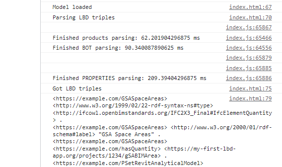
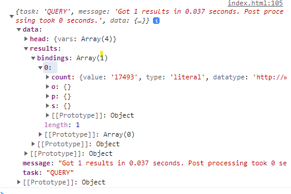
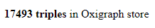

# Linked Building Data BIM app tutorial

This tutorial was developed for the 3rd Summer School of Linked Data in Architecture and Construction ([SSoLDAC](https://linkedbuildingdata.net/ldac2023/summerschool)). As part of the Interaction and querying lecture by [Mads Holten Rasmussen](https://www.linkedin.com/in/mads-holten-rasmussen-061b7414/), [NIRAS](https://www.niras.com/).

If you didn't do the first part, [start here](https://github.com/LBD-Hackers/LBD-app-tutorial/tree/00_Start).

## Overview
1. [Start](https://github.com/LBD-Hackers/LBD-app-tutorial/tree/00_Start)
1. [Dependencies](https://github.com/LBD-Hackers/LBD-app-tutorial/tree/01_Dependencies)
1. [Load IFC](https://github.com/LBD-Hackers/LBD-app-tutorial/tree/02_Load_IFC)
1. [Parse LBD](https://github.com/LBD-Hackers/LBD-app-tutorial/tree/03_Parse_LBD)
1. [In-memory triplestore](https://github.com/LBD-Hackers/LBD-app-tutorial/tree/04_In-memory_Triplestore)
1. Dynamic UI
1. [Load/Save RDF](https://github.com/LBD-Hackers/LBD-app-tutorial/tree/06_Save)

## 6. Dynamic UI

Instead of having a button that gets spaces and loads these to the console, let's make a dropdown list with all the storeys in the building that has spaces. First we add the select in the HTML body:

```html
<select name="storey-select" id="storey-select">
</select>
```

Note that there are no select options yet. These will be populated by the actual storeys in the uploaded IFC. Also be sure that you change the load method so it makes the select visibile instead of the button we just removed.

Next step is to define the method that populates the storey-select. Execute this function as part of the `loadInStore()` function right after the triples are loaded. While I develop I like to use a handy query like the one shown below that will give me all the properties that are available for the storey instances:

```javascript
async function populateStoreySelect(){
    const query = `PREFIX bot: <https://w3id.org/bot#> 
    SELECT DISTINCT ?p
    WHERE { 
        ?s a bot:Storey ; 
            ?p ?o 
    }`;
    const {data} = await asyncOxigraph.query(query);
    console.log(data);
}
```

I can see from the list that we have access to a lot of attributes that exist in the model but not something I can expect to find in any model (like `https://my-first-lbd-app.org/projects/1234/elevationPSetRevitConstraints`). Properties like this are extracted from the IFC-LBD property extractor and the used approach can be discussed. For now, let's not depend on it and stick to the well established ones like `rdfs:label`, `bot:hasSpace`,  and `bot:hasElement`.

We would like to return only storeys that have spaces and we would like to have the name of the storey, so we change the query to this:

```sparql
PREFIX bot: <https://w3id.org/bot#>
PREFIX rdfs: <http://www.w3.org/2000/01/rdf-schema#> 

SELECT DISTINCT ?uri ?name
WHERE { 
    ?uri a bot:Storey ; 
        bot:hasSpace ?s ;
        rdfs:label ?name 
} ORDER BY ?name
```

We do a bit of post-processing of the query result to get a simple list of objects each having a `name` and a `uri` key with string values. For this we use the map function to iterate over the result bindings and return the value of each of the variables:

```javascript
const {data} = await asyncOxigraph.query(query);
const storeys = data.results.bindings.map(b => {
    const name = b.name.value;
    const uri = b.uri.value;
    return {uri, name};
});
console.log(storeys);
```

The result should look like this:



Now where we have confirmed that this works, instead of mapping to an array, we will add options to the `storey-select`. There are more elegant ways to do this with frameworks like [React](https://react.dev/) or [Angular](https://angular.io/), but I promised to do vanilla JS, so here you go. We get a reference to the select element and as we iterate over the binding results we create new select options and assign them to the select element:

```javascript
const select = document.getElementById("storey-select");
data.results.bindings.forEach((b, i) => {
    const option = document.createElement('option');
    option.text = b.name.value;
    option.value = b.uri.value;
    select.add(option, i);
});
```

And now we should see something like this:



Now we need to add an event listener to the `storey-select` and do something when the user selects a storey. Let's first just log the selected URI and query for anything we know about that storey:

```javascript
document.getElementById("storey-select").addEventListener("change", ev => getStoreyData(ev.target.value));

async function getStoreyData(storeyURI){
    console.log(storeyURI);
    const query = `SELECT * WHERE {
        <${storeyURI}> ?p ?o
    }`;
    const {data} = await asyncOxigraph.query(query);
    console.log(data);
}
```

You should see that new results are logged each time the user selects a storey. To keep this example simple, let's just list all the spaces at the storey in an unordered list `<ul>`. Add the following to the HTML body:

```html
<ul id="space-list"></ul>
```

And change the `getStoreyData()` function to the below. The query retrieves all spaces in the storey in a list ordered by the name of the space. The unordered list element is retrieved and it's content is wiped by setting its innerHTML to nothing. Then as we iterate over the results we append new list items `<li>` to the list. We set the innerHTML to the name of the space and the id to the URI of that space. We also change the cursor to indicate that it is clickable. When the user clicks we assign an event listener that logs the space id/URI to the console.

```javascript
async function getStoreyData(storeyURI){
        const query = `PREFIX bot: <https://w3id.org/bot#>
        PREFIX rdfs: <http://www.w3.org/2000/01/rdf-schema#> 
        SELECT ?space ?name WHERE {
            <${storeyURI}> bot:hasSpace ?space .
            ?space rdfs:label ?name
        } ORDER BY ?name`;
        const {data} = await asyncOxigraph.query(query, "application/ld+json");
        const list = document.getElementById("space-list");
        list.innerHTML = "";
        data.results.bindings.forEach(b => {
            const item = document.createElement('li');
            item.innerHTML = b.name.value;
            item.id = b.space.value;
            item.style.cursor = "pointer";
            item.addEventListener("click", (ev) => console.log(ev.target.id));
            list.appendChild(item);
        });
    }
```

Now we should have a list that changes when the user selects a storey:



As a last thing, we adjust the `populateStoreySelect()` function. First of all, we add an optional sub-query that counts the number of spaces for each storey (if any). We add this information in the storey select. Note that we set the value of spaceCount to 0 if the returned value is undefined which will be the case for storeys with no spaces. We also specify that we wish to get information from the first storey in the list.

```javascript
async function populateStoreySelect(){
    const query = `PREFIX bot: <https://w3id.org/bot#>
    PREFIX rdfs: <http://www.w3.org/2000/01/rdf-schema#> 
    SELECT ?uri ?name ?spaceCount
    WHERE { 
        ?uri a bot:Storey ;
            rdfs:label ?name
        OPTIONAL {
            SELECT ?uri (COUNT(?s) AS ?spaceCount)
            WHERE{
                ?uri bot:hasSpace ?s
            } GROUP BY ?uri
        }
    }
    ORDER BY ?name`;
    const {data} = await asyncOxigraph.query(query);

    // Add options to storey-select
    const select = document.getElementById("storey-select");
    data.results.bindings.forEach((b, i) => {
        const option = document.createElement('option');
        const spaceCount = b.spaceCount.value ?? 0;
        option.text = `${b.name.value} [${spaceCount}]`;
        option.value = b.uri.value;
        select.add(option, i);

        // For first option, also get storey data
        if(i === 0) getStoreyData(b.uri.value);
    });

    // Display button for getting spaces after loading
    document.getElementById("storey-select").style.display = "block";
}
```

In the [next step](https://github.com/LBD-Hackers/LBD-app-tutorial/tree/06_Save) it is demonstrated how you can download/upload RDF and persist changes to the store content.

[](https://www.buymeacoffee.com/madsholten)