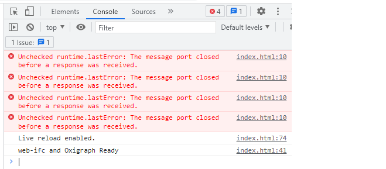

# Linked Building Data BIM app tutorial

This tutorial was developed for the 3rd Summer School of Linked Data in Architecture and Construction ([SSoLDAC](https://linkedbuildingdata.net/ldac2023/summerschool)). As part of the Interaction and querying lecture by [Mads Holten Rasmussen](https://www.linkedin.com/in/mads-holten-rasmussen-061b7414/), [NIRAS](https://www.niras.com/).

If you didn't do the first part, [start here](https://github.com/LBD-Hackers/LBD-app-tutorial/tree/00_Start).

## Overview
1. [Start](https://github.com/LBD-Hackers/LBD-app-tutorial/tree/00_Start)
1. Dependencies
1. [Load IFC](https://github.com/LBD-Hackers/LBD-app-tutorial/tree/02_Load_IFC)
1. [Parse LBD](https://github.com/LBD-Hackers/LBD-app-tutorial/tree/03_Parse_LBD)
1. [In-memory triplestore](https://github.com/LBD-Hackers/LBD-app-tutorial/tree/04_In-memory_Triplestore)
1. [Dynamic UI](https://github.com/LBD-Hackers/LBD-app-tutorial/tree/05_Dynamic)

## 2. Dependencies
In this step we will install some dependencies.

In the app we are building we will be using the most low-level version of [IFC.js](https://ifcjs.io/) called [web-ifc](https://github.com/IFCjs/web-ifc). This library is built in C++ and is lightning fast ⚡ at reading IFC files in the native Express/STEP format 👴👵. Thanks to [Webassembly](https://webassembly.org/) we can use it directly in a web browser 😎🚀.

[IFC-LBD](https://github.com/LBD-Hackers/IFC-LBD) is built on top of web-ifc, and it contains a set of parsers that extracts facts from the IFC file and describes them as [RDF](https://www.w3.org/RDF/) triples. It was initiated by [Mads Holten Rasmussen](https://www.linkedin.com/in/mads-holten-rasmussen-061b7414/) and members of the LBD community are encouraged to continue the development!

[Oxigraph](https://github.com/oxigraph/oxigraph) is a really fast triplestore that is written in [Rust](https://www.rust-lang.org/) and like web-ifc made available as a web-assembly (wasm) file. Since loading and querying the triplestore is blocking the main thread and thereby freezing the web browser we will be running it in a web worker using the [async-oxigraph](https://github.com/LBD-Hackers/async-oxigraph) library.

### Adding them
You will need all the files stored in the assets folder of this repository. These include wasm-files for web-ifc version 0.0.41 and Oxigraph version 0.3.16 + the web worker and some scripts for async-oxigraph version 0.0.6.

We define an [importmap](https://developer.mozilla.org/en-US/docs/Web/HTML/Element/script/type/importmap) that specifies the specific versions of the dependencies that are to be used. Add the below to the `body`-section of `index.html`.

```html
<script type="importmap">
    {
        "imports": {
            "web-ifc": "https://unpkg.com/web-ifc@0.0.41/web-ifc-api.js",
            "ifc-lbd": "https://unpkg.com/ifc-lbd@0.3.7/dist/index.js",
            "async-oxigraph": "https://unpkg.com/async-oxigraph@0.0.6/dist/index.js",
            "jsonld": "https://unpkg.com/jsonld@8.2.0/dist/jsonld.esm.js",
            "rxjs": "https://unpkg.com/rxjs@7.5.4/dist/esm/index.js",
            "tslib": "https://unpkg.com/tslib@2.3.1/tslib.es6.js"
        }
    }
</script>
```

We will also be using the [JSON-LD](https://json-ld.org/) library to manipulate RDF serialized as JSON-LD. This library is added in a more traditional way by simply adding this (I couldn't get it to work with the import map - can you?):

```html
<script src="https://unpkg.com/jsonld@8.2.0/dist/jsonld.min.js"></script>
```

Then a `jsonld` object will simply be available globally.

### Setting them up
All the code we will be writing will happen in a separate script in the bottom of the HTML body element. For now we just import the necessary libraries and instantiate the webassembly files.

```html
<script type="module">
    import { LBDParser, ParserSettings } from "ifc-lbd";
    import { IfcAPI } from "web-ifc";
    import { AsyncOxigraph } from "async-oxigraph";

    // Init web-ifc and Oxigraph
    const ifcAPI = new IfcAPI();
    const asyncOxigraph = new AsyncOxigraph("./assets/oxigraph/worker.js");
    initWebIFCAndOxigraph();

    async function initWebIFCAndOxigraph(){
        ifcAPI.SetWasmPath("./assets/");
        await Promise.all([
            asyncOxigraph.init(),
            ifcAPI.Init()
        ]);
        console.log("web-ifc and Oxigraph Ready");
    }
</script>
```

If you are unfamiliar with async coding and [promises](https://developer.mozilla.org/en-US/docs/Web/JavaScript/Reference/Global_Objects/Promise) it might be a bit hard to understand the last part of the code. I will explain it briefly below, but if you really want to dig deeper you should [watch this awesome video that explains the event loop](https://www.youtube.com/watch?v=8aGhZQkoFbQ). It's everywhere in modern coding, so better learn it now than later.

The `initWebIFCAndOxigraph()` function is defined as an `async` function meaning that it is asynchronous (ie. happening in the background). This function simply executes two other async functions (instantiating Oxigraph and web-ifc) in parallel using the Promise.all() function. The `await` prefix tells the interpreter to wait until this is finished before we can continue. For now we just print something to the console, and you can see this if you open the developer tools in your browser (F12 in Chrome).



If you see this in the console you are good and we can continue to next step where we allow the user to [Load an IFC](https://github.com/LBD-Hackers/LBD-app-tutorial/tree/02_Load_IFC).

[](https://www.buymeacoffee.com/madsholten)