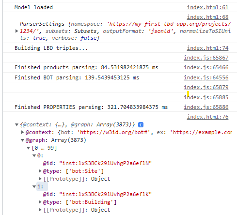

# Linked Building Data BIM app tutorial

This tutorial was developed for the 3rd Summer School of Linked Data in Architecture and Construction ([SSoLDAC](https://linkedbuildingdata.net/ldac2023/summerschool)). As part of the Interaction and querying lecture by [Mads Holten Rasmussen](https://www.linkedin.com/in/mads-holten-rasmussen-061b7414/), [NIRAS](https://www.niras.com/).

If you didn't do the first part, [start here](https://github.com/LBD-Hackers/LBD-app-tutorial/tree/00_Start).

## Overview
1. [Start](https://github.com/LBD-Hackers/LBD-app-tutorial/tree/00_Start)
1. [Dependencies](https://github.com/LBD-Hackers/LBD-app-tutorial/tree/01_Dependencies)
1. [Load IFC](https://github.com/LBD-Hackers/LBD-app-tutorial/tree/02_Load_IFC)
1. Parse LBD
1. [In-memory triplestore](https://github.com/LBD-Hackers/LBD-app-tutorial/tree/04_In-memory_Triplestore)
1. [Dynamic UI](https://github.com/LBD-Hackers/LBD-app-tutorial/tree/05_Dynamic)

## 4. Parse LBD

In this step we will be using the IFC-LBD library to extract RDF triples from the IFC file. The library was initiated by Mads Holten Rasmussen and members of the LBD community are encouraged to continue the development!

We remove the space processing part (everything between where we load the model and get the modelID) from last step and instead, we add the following after loading the model and retrieving the modelID:

```javascript
// Specify settings. Change as you wish. Only need BOT and Products? Another namespace?
const settings = new ParserSettings();
settings.namespace = "https://my-first-lbd-app.org/projects/1234/";
console.log(settings);

// Init LBD Parser with these settings
const lbdParser = new LBDParser(settings);

// Run parse method to get JSON-LD RDF
const jsonldTriples = await lbdParser.parse(ifcAPI, modelID);
console.log(jsonldTriples);
```

The console should now log the settings and the resulting RDF triples in JSON-LD serialization.



In the [next step](https://github.com/LBD-Hackers/LBD-app-tutorial/tree/04_In-memory_Triplestore) we will load these triples in an Oxigraph triplestore and start executing queries against it.

[](https://www.buymeacoffee.com/madsholten)