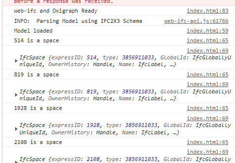

# Linked Building Data BIM app tutorial

This tutorial was developed for the 3rd Summer School of Linked Data in Architecture and Construction ([SSoLDAC](https://linkedbuildingdata.net/ldac2023/summerschool)). As part of the Interaction and querying lecture by [Mads Holten Rasmussen](https://www.linkedin.com/in/mads-holten-rasmussen-061b7414/), [NIRAS](https://www.niras.com/).

If you didn't do the first part, [start here](https://github.com/LBD-Hackers/LBD-app-tutorial/tree/00_Start).

## Overview
1. [Start](https://github.com/LBD-Hackers/LBD-app-tutorial/tree/00_Start)
1. [Dependencies](https://github.com/LBD-Hackers/LBD-app-tutorial/tree/01_Dependencies)
1. Load IFC
1. [Parse LBD](https://github.com/LBD-Hackers/LBD-app-tutorial/tree/03_Parse_LBD)
1. [In-memory triplestore](https://github.com/LBD-Hackers/LBD-app-tutorial/tree/04_In-memory_Triplestore)
1. [Dynamic UI](https://github.com/LBD-Hackers/LBD-app-tutorial/tree/05_Dynamic)
1. [Load/Save RDF](https://github.com/LBD-Hackers/LBD-app-tutorial/tree/06_Save)

## 3. Load IFC
In this step we will be loading an IFC. If you don't have one at hand you can use the typical [Duplex model](https://raw.githubusercontent.com/MadsHolten/BOT-Duplex-house/master/Model%20files/IFC/Duplex.ifc).

We add a simple button (no styling for now) to the body of the HTML document above all the script tags. 

```html
<button>Load IFC</button>
```

Since we would like the user to only upload an IFC after web-ifc and Oxigraph is ready we initially set the display style of the button to be none. This means that the button will not be visible. We also give it an id which we can use to access the element and change this setting after the tools are ready.

```html
<button id="load-ifc" style="display: none;">Load IFC</button>
```

At the end of the `initWebIFCAndOxigraph()` function we add the following to change the display setting of the button after the tools are ready.

```javascript
document.getElementById("load-ifc").style.display = "block";
```

Still the button has no functionality when you click it. The behavior we want is that the browser prompts the user to select a file when clicking the button. We can trigger this by having a hidden file input field that will be "clicked" when the user clicks the "Load IFC" button.

```html
<button id="load-ifc" onclick="document.getElementById('file-input').click()" style="display: none;">Load IFC</button>
<input type="file" accept=".ifc" id="file-input" style="display: none;">
```

Now we need to actually do something when a user uploads a file. We listen to the change event of the file input which will receive the file the user uploads. We define the following event listener and assosiated function.

```javascript
document.getElementById("file-input").addEventListener("change", ev => processIFC(ev));

async function processIFC(ev){
    console.log(ev.target.files[0]);
}
```

The event listener takes a callback function as the second argument and we assign this with an arrow function. This is equivalent to writing

```javascript
addEventListener("change", function(ev){
    processIFC(ev);
});
```

For now we just log the first (and only) file to the console. If the user should be able to upload multiple files the input field should be configured as such.


We need to read the file to an [arraybuffer](https://developer.mozilla.org/en-US/docs/Web/JavaScript/Reference/Global_Objects/ArrayBuffer) that we can pass to web-ifc and for that we need a little helper-function that reads the file and returns an array buffer as a promise:

```javascript
async function processIFC(ev){
    const file = ev.target.files[0];
    const arrayBuffer = await readFile(file);
    console.log(arrayBuffer);
}

async function readFile(file) {
    return new Promise((resolve, reject) => {
        const reader = new FileReader()
        reader.addEventListener("loadend", (e) => resolve(e.target.result));
        reader.addEventListener("error", reject);
        reader.readAsArrayBuffer(file);
    })
}
```

We should now see something like this in the console:


Let's use web-ifc to do something with this. The process is 1) Open file, 2) Do something and 3) close again to release memory. For example, we can get the spaces and their properties. Before doing so we can als change the visibility of the button so the user doesn't upload more IFC files:

```javascript
async function processIFC(ev){
    const file = ev.target.files[0];
    const arrayBuffer = await readFile(file);

    // Hide IFC upload button
    document.getElementById("load-ifc").style.display = "none";
    
    // Load in web-ifc
    const modelID = ifcAPI.OpenModel(new Uint8Array(arrayBuffer));

    // MODEL IS NOW LOADED AND AVAILABLE IN MEMORY
    // DO WHATEVER OPRATIONS WHILE YOU HAVE IT
    console.log("Model loaded");

    // To validate, let's get the spaces
    const spaceIDs = ifcAPI.GetLineIDsWithType(modelID, IFCSPACE);
    for (let i = 0; i < spaceIDs.size(); i++) {
        const expressID = spaceIDs.get(i);
        console.log(`${expressID} is a space`);

        // Get space properties
        const properties = await ifcAPI.properties.getItemProperties(modelID, expressID);
        console.log(properties);
    }

    // Always close after use
    ifcAPI.CloseModel(modelID);
}
```



In the [next step](https://github.com/LBD-Hackers/LBD-app-tutorial/tree/03_Parse_LBD) we will be using the IFC-LBD parser to get [BOT](https://w3id.org/bot) triples etc.

[](https://www.buymeacoffee.com/madsholten)
